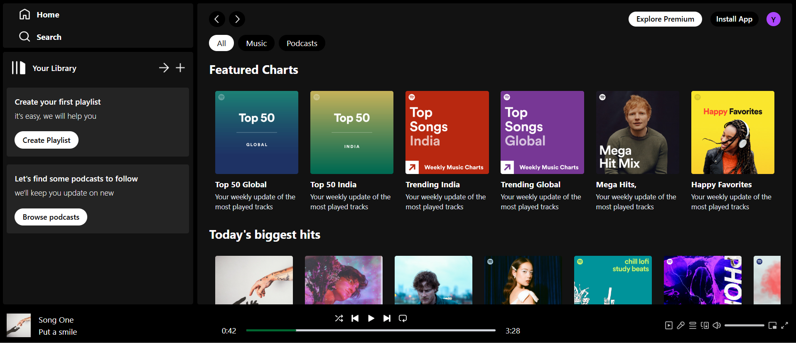

# 🎵 [Spotify Clone Using React](https://spotifyclone-lac.vercel.app/)

A visually polished and fully responsive **Spotify Web UI clone** built with React. This project emulates the core design and functionality of Spotify’s web player, featuring modern UI elements, music playback capabilities, and smooth navigation — all wrapped in a clean, dark-themed aesthetic.

## 🚀 Features

- 🎧 Browse and preview **featured playlists**
- 🎵 Simulated **music playback interface**
- 🎨 Dark theme with modern **Spotify-inspired UI**
- 📱 Fully **responsive design** for desktop and mobile
- ⚡ Smooth UI interactions and animations

## 🛠️ Tech Stack

- **React** (v18+) — Core frontend library  
- **Tailwind CSS** — Utility-first CSS for responsive and modern styling  
- **JavaScript** — Application logic and interactivity  
- **Node.js** — Backend environment for future API integrations *(optional)*

## 🌐 Live Demo

👉 [https://spotifyclone-lac.vercel.app/](https://spotifyclone-lac.vercel.app/)

---

> 💡 This project was created to deepen my understanding of React component architecture, Tailwind CSS styling, and real-world UI replication. Ideal for those looking to explore frontend best practices and modern web design.

